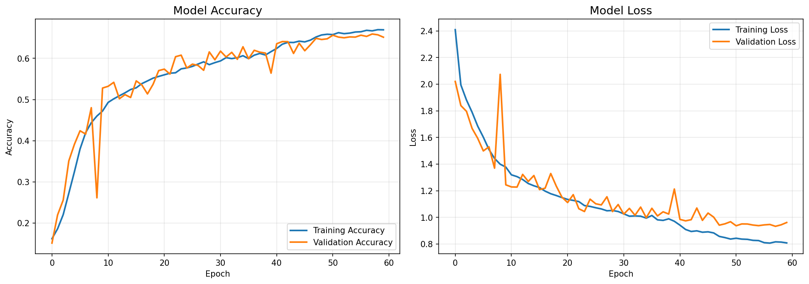

# Real-Time Emotion Recognition

A CNN-based emotion recognition system that detects facial emotions in real-time using OpenCV and TensorFlow/Keras.

## Features

- **Real-time face detection** using Haar Cascade classifier
- **Emotion classification** using a lightweight 4-block CNN
- **7 emotion classes**: Angry, Disgust, Fear, Happy, Sad, Surprise, Neutral
- **Live webcam feed** with emotion labels displayed above detected faces

## Project Structure

```
emotion guess/
├── data/
│   ├── train/          # Training images organized by emotion
│   │   ├── Angry/
│   │   ├── Disgust/
│   │   ├── Fear/
│   │   ├── Happy/
│   │   ├── Sad/
│   │   ├── Surprise/
│   │   └── Neutral/
│   └── test/           # Test images (same structure as train)
├── models/
│   ├── haarcascade_frontalface_default.xml  # Face detection model
│   └── emotion_model.keras                   # Trained emotion model (after training)
├── src/
│   ├── model.py        # CNN architecture definition
│   ├── preprocess.py   # Data loading and preprocessing
│   ├── train.py        # Model training script
│   └── predict.py      # Real-time emotion detection
├── requirements.txt    # Python dependencies
└── README.md          # This file
```

## Installation

1. **Clone or navigate to the project directory**

2. **Create a virtual environment** (recommended):
   ```bash
   python -m venv venv
   venv\Scripts\activate  # Windows
   # or
   source venv/bin/activate  # Linux/Mac
   ```

3. **Install dependencies**:
   ```bash
   pip install -r requirements.txt
   ```

## Dataset Setup

This project uses the **FER2013** dataset. The data should already be organized in the following structure:

```
data/
├── train/
│   ├── Angry/
│   ├── Disgust/
│   ├── Fear/
│   ├── Happy/
│   ├── Sad/
│   ├── Surprise/
│   └── Neutral/
└── test/
    └── (same subfolders)
```

Each subfolder should contain grayscale face images (48x48 pixels).

## Usage

### 1. Verify Data Structure

Before training, verify your data is correctly organized:

```bash
python src/preprocess.py
```

This will display the number of images in each emotion category.

### 2. Train the Model

Train the CNN on your dataset:

```bash
python src/train.py
```

**Training parameters:**
- Epochs: 60 (with early stopping)
- Batch size: 64
- Learning rate: 0.001 (with reduction on plateau)
- Early stopping patience: 10 epochs

The trained model will be saved to `models/emotion_model.keras`.

### 3. Run Real-Time Detection

After training, start the webcam emotion detection:

```bash
python src/predict.py
```

**Controls:**
- The app will open your webcam
- Your face will be detected with a green box
- The predicted emotion will appear above your face
- **Press ESC to exit**

## Model Architecture

The CNN consists of 4 convolutional blocks:

| Block | Filters | Layers |
|-------|---------|--------|
| 1 | 32 | Conv2D → BatchNorm → Conv2D → BatchNorm → MaxPool → Dropout(0.25) |
| 2 | 64 | Conv2D → BatchNorm → Conv2D → BatchNorm → MaxPool → Dropout(0.25) |
| 3 | 128 | Conv2D → BatchNorm → Conv2D → BatchNorm → MaxPool → Dropout(0.25) |
| 4 | 256 | Conv2D → BatchNorm → Conv2D → BatchNorm → MaxPool → Dropout(0.25) |

Followed by:
- Flatten → Dense(512) → BatchNorm → Dropout(0.5)
- Dense(256) → BatchNorm → Dropout(0.5)
- Dense(7, softmax)

## Requirements

- Python 3.8+
- TensorFlow 2.15+
- OpenCV 4.8+
- NumPy 1.24+
- Matplotlib 3.7+

## Troubleshooting

**Camera not opening:**
- Check if another application is using the webcam
- Try changing `camera_index` in `predict.py` (0, 1, or 2)

**Model not found error:**
- Make sure you've trained the model first with `python src/train.py`

**Low accuracy:**
- Ensure proper lighting when using webcam
- Face should be clearly visible and front-facing
- Try retraining with more epochs or adjusted learning rate

## Training Results

The model was trained on FER2013 dataset achieving **~66% validation accuracy**.



## License

This project is for educational purposes.

## Acknowledgments & Credits

### Dataset
- **FER2013 (Facial Expression Recognition 2013)**
  - Created by Pierre-Luc Carrier and Aaron Courville for the ICML 2013 Challenges in Representation Learning
  - Contains ~35,000 grayscale 48x48 face images labeled with 7 emotions
  - [Kaggle Dataset](https://www.kaggle.com/datasets/msambare/fer2013)

### Face Detection
- **Haar Cascade Classifier** (`haarcascade_frontalface_default.xml`)
  - Part of OpenCV library
  - Originally proposed by Paul Viola and Michael Jones in "Rapid Object Detection using a Boosted Cascade of Simple Features" (2001)
  - Trained by Rainer Lienhart
  - [OpenCV GitHub Repository](https://github.com/opencv/opencv/tree/master/data/haarcascades)

### Frameworks
- [TensorFlow/Keras](https://www.tensorflow.org/) for deep learning
- [OpenCV](https://opencv.org/) for computer vision

---

> **Note:** This README and code documentation were generated with assistance from AI.
